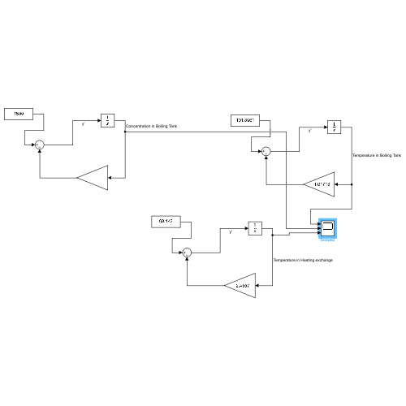

# Simulation of Beer Continous Flow Production

The goal is to design on simulink a beer factory
- As a client, I have two main constraints :
- I have the room 202 to install this factory 15 x 6 x 3m
- I want to have as much beer as possible using my own process :
- Milling where barley can only be delivered once a day (working stock has to be stored in
the factory). Water comes from the outside at a max temp of 56°C
- Boiling at 100°C for 60 minutes
- Cooling to go from 100°C down to at least 37°C, but not below 25°C
- Fermentation for 5 days, with the constraint that a fermentation tank once started can
only be filled for 24hours before being closed to start the fermentationSome useful data
- [Barley/water] = 200 kg.m-3
- [Hops/water] = 20 kg.m-3
- U (heating tank) = 3.10^4 J.h-1.m-2.°C-1
- U (heat exchanger) = 3.10^6 J.h-1.m-2.°C-1
- Volumic mass water = 1000 kg.m-3
- Volumic mass barley & hops = 1000 kg.m-3
- Volumic mass mash (barley+water) = 1500kg.m-3
- Cp = 4182 J.kg-1.°C-1

# Simulink Flow Chart

